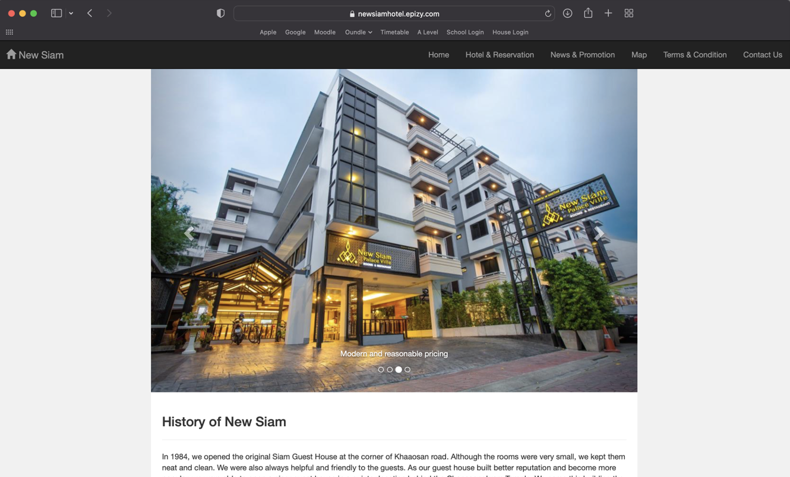

<!-- PROJECT TITLE -->
# Hotel Reservation Website

The initial design project focusing on the booking management system for a client hotel

<!-- TABLE OF CONTENTS -->

  
Table of Contents

  <ol>
    <li>
      <a href="#about-the-project">About The Project</a>
      <ul>
        <li><a href="#built-with">Built With</a></li>
      </ul>
    </li>
    <li><a href="#usage">Usage</a></li>
  </ol>

<!-- ABOUT THE PROJECT -->
## About The Project

This project is a full-stack website developed for a hotel client to produce an updated, GUI friendly interface for guests, including a new booking system for the hotel.

The main goals of this project are:
1. A remodel of the old hotel's website to design a more clean and updated look.
2. An integrated booking system to allow guests to directly book from the website, instead of emailing for room enquires.

### Built With

* Frontend: HTML, CSS, Javascript
* Backend: PHP
* Local Hosting: XAMPP
* Online Hosting: InfinityFree

(<a href="#readme-top">back to top</a>)

<!-- USAGE -->
## Usage

This project was originally hosted on [InfinityFree](https://www.infinityfree.com), but has since been removed from online hosting after the project evalution, as it is an initial design that is no longer in use. The online product and the development documentation of this project is no longer accessible to the public.

(<a href="#readme-top">back to top</a>)

